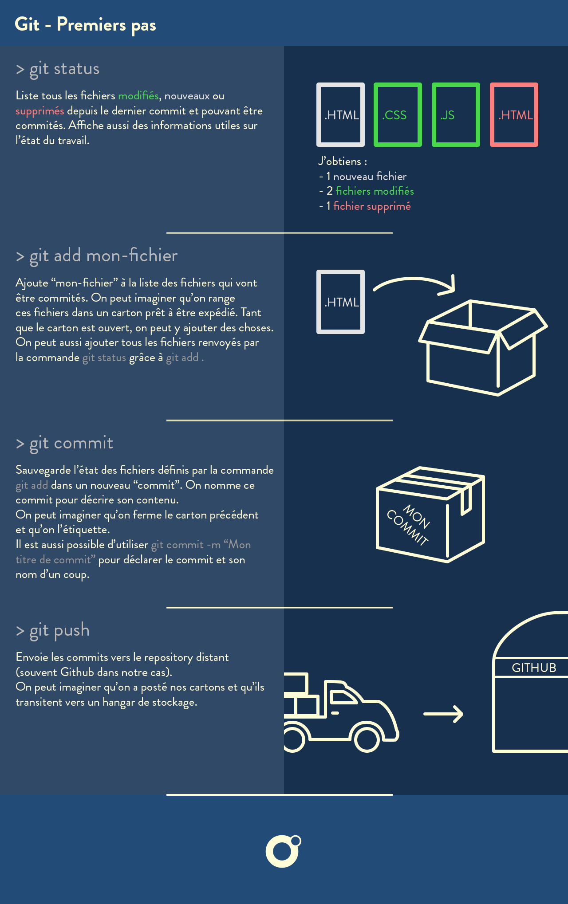

# **Commandes Git** vuent jusqu'à aujourd'hui :  

## Cloner un dépo

- Se placer dans le dossier ou on veut cloner le dépo avec le terminal et taper la commande :
```
git clone lien_obtenu_sur_github_en_cliquant_sur_Code_https
```

>*ex* : git clone https://github.com/O-clock-Tardis/S01E02-recette-pancakes-olivier-oclock.git

- Entrer son **Pseudo** ou **email** **Github**  
- Entrer le **mdp** *(attention, on dirait que rien se s'écrit quand on entre le MDP, mais c'est quand même le cas)*

C'est fait ! le(s) dossier(s) sont copier sur votre machine.

***

## Pour commiter et pusher sur le dépo cloné
 

>:warning: **toutes ces manip's sont à faire depuis le fichier clôné qui lors du clonage à été automatiquement lié avec le dépo créé lorsqu'on accepte le challenge**
- Je rempli mon carton, je précise les fichiers à commiter
`git add .`

- Je referme et j'étiquette mon carton, j'associe un message à mon commit
`git commit -m "Modification du CSS"`

- Si vous avez un message d'arreur après un commit du genre `fatal: unable to auto-detect email address (got 'student@teleporter.(none)')`

- Faire les 2 commandes suivantes : 
`git config --global user.email "VOTREEMAIL@example.com"`
`git config --global user.name "VOTRE NOM"`

- J'expédie mon carton vers github, j'envoie mon commit sur github
`git push`




